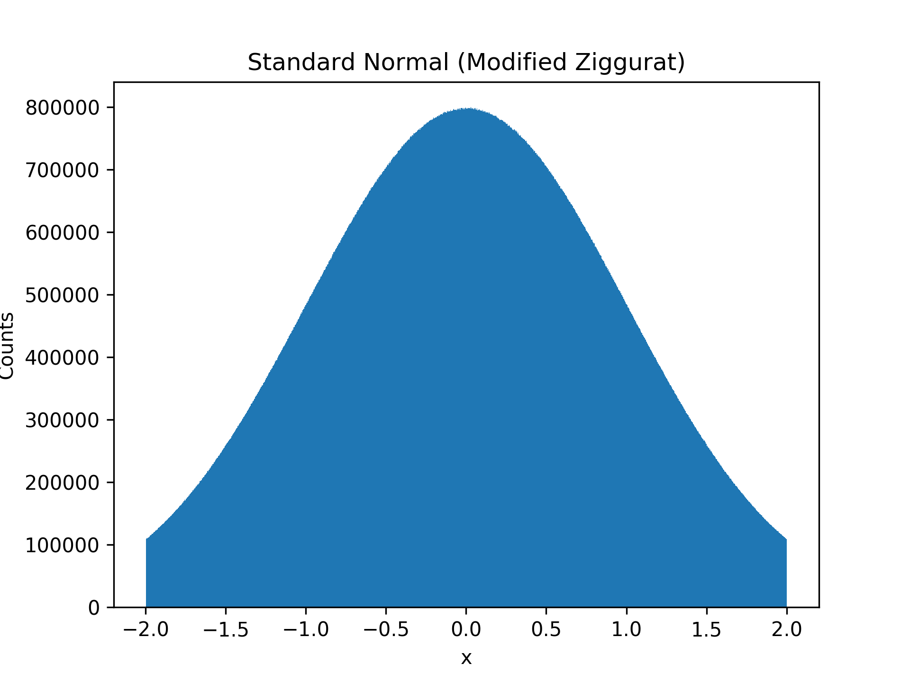

# Fast PRNG: an Exponentially- and Normally-distributed PseudoRandom Number Generator

## OVERVIEW
-----------
This code is the implementation of [A modified ziggurat algorithm for generating 
exponentially and normally distributed pseudorandom numbers](http://www.tandfonline.com/doi/abs/10.1080/00949655.2015.1060234).

[Alex Herbert](https://github.com/aherbert) has detected and fixed two bugs: one in the fast rejection sampling of the normal PRNG, and another where the indexing of both the exponential and normal overhang derivatives were off by 1. Please note that neither bug was detectable in first six moments of the generated distributions (precise to one part in one million). Thank you Alex!

## INSTALLATION & USAGE
-----------------------
### C/C++

Source code and functions are found in exponential.h and normal.h. Simply 
include this directory in the path of your compiler. For an example of usage, 
see benchmarks/profile.c, which profiles the exponential PRNG with the 
compilation command:

    $ gcc -O2 -DEXPONENTIAL profile.c -lm -o exponential_profiler.out

### Fortran 

Scott Boyce has generously translated this algorithm into GNU Fortran: https://code.usgs.gov/fortran/bif  

### Python

Install via the [Python Package Index](https://pypi.python.org/pypi):
            
    $ pip install fast_prng

The module's functions mimic numpy.random functions of the same name. 

### Matlab

Install via the command:
            
    $ matlab/install_matlab_functions.sh

This script will install to the default MATLAB userpath, unless $USERPATH is 
redefined. The installed functions: fast_exprnd, fast_randn, and fast_rand
behave identically to the native MATLAB functions that share the same name. 
Ensure that the mex compiler is configured and accessibles in the system PATH 
(or specify $PATH within install_matlab_functions.sh). 

## CONTACT
---------
Feedback is most appreciated. If you have any questions or suggestions, please 
contact me at christopherdmcfarland [at] gmail [dot] com

WEBSITE
-------
Documentation and source code can be found at https://github.com/cd-mcfarland/fast_prng

## FILE MANIFEST
----------------
    
### MT19937.h  

Uniform PRNG based on [Super-Fast Mersene Twister](http://www.math.sci.hiroshima-u.ac.jp/~m-mat/MT/SFMT/). Some code that 
supported older architectures was removed. Functions for seeding the PRNG and 
accessing PRNs without unnecessary bounds-checking were added.
    
### exponential.h  
    
Exponential PRNG to be used with C/C++ code.         

### normal.h  

Normal PRNG to be used with C/C++ code. 

### shared.h

Shared constants and MACROS used by exponential.h and normal.h.

### create_layers.py  

Python script that calculates X, L_max, A, f(X), and epsilon (described in the 
main text). All calculations are done to long double precision, and then rounded 
to double precision.
    
### erfl.pyx  

Long double precision Error function for create_layers.py
    
### quality_test.c 

Returns raw moments of a set of PRNs. An example of usage is described in the 
Appendix of the main text.
    
### benchmarks/  
    
A collection of profiling scripts. profile.c requires a definition at compile-time 
(e.g. EXPONENTIAL, NORMAL) that selects the algorithm to profile. For example:

    $ gcc -O2 -DNORMAL profile.c -lm -o normal.out
    $ ./normal.out
    Created 1000000000 Standard Normal (Modified Ziggurat) distributed PRNs with mean 2.39616e-05.
    Startup time: 55 (us).
    Mean execution time (per PRN): 7.987 (ns).

Competing algorithms are also provided. 
    
### matlab/  
    
Extensions for Matlab/Octave.

### histogram/

Generates histogram of PRNGs. For example:
    
    $ gcc -DNORMAL -O3 histogram.c -lm -o normal.out
    $ ./normal.out
    $ ./plot_histogram.py
Creates the following graph:

